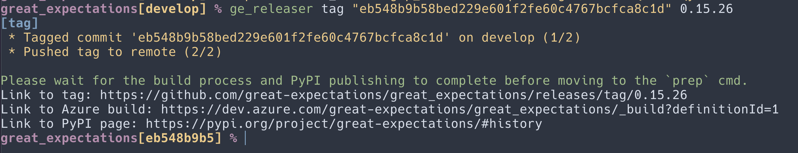
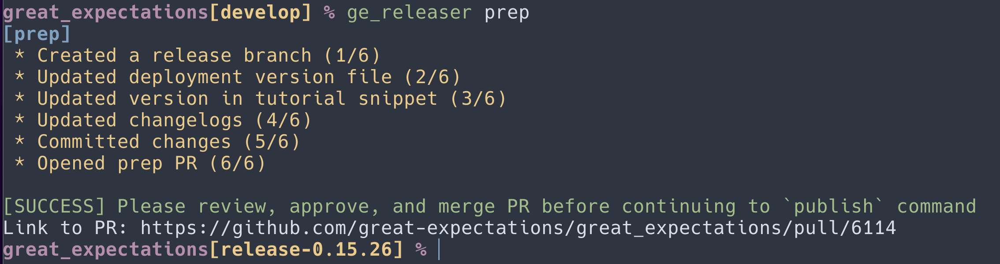
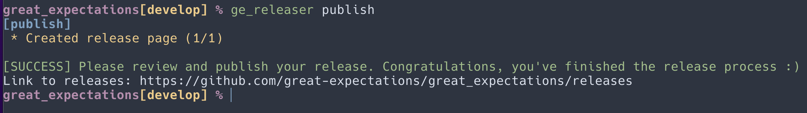

[](https://results.pre-commit.ci/latest/github/greatexpectationslabs/ge_releaser/main)

# ge_releaser

A CLI tool built to streamline the process of cutting releases each week in the OSS repository.

---

## Installation
```bash
# Preferably run all this in a venv
git clone git@github.com:greatexpectationslabs/ge_releaser.git
cd ge_releaser
pip install -e .
```

```bash
# Alternative
gh repo clone greatexpectationslabs/ge_releaser
cd ge_releaser
python3 -m venv .venv
source .venv/bin/activate
pip install -e .
```

## Commands
These commands are to be executed in Great Expectations development directory (be sure to check out the `develop` branch).

```bash
# Commands are meant to be run sequentially
ge_releaser tag <git_hash> <semver>      # Tag the appropriate commit and trigger the build process
ge_releaser prep                         # Modify changelog and open a PR.
ge_releaser publish                      # Create a new GitHub release page
```

Please follow the detailed instructions below to know when to progress to the next step.

The tool is designed to do pretty much EVERYTHING for you. Do not run isolated `git` commands (unless resolving merge conflicts).

---

## Walkthrough

`ge_releaser` acts as an abstraction on top of our standard manual release process. While the following steps should get you creating releases with ease, it is also important to understand what is happening under the hood. For each of the primary commands that `ge_releaser` offers, the individual manual steps taken by the machine are noted below. Although you shouldn't have to use them, it may be handy if debugging is required.
> :warning: Please note that if the release is for a major or minor version, the docs will need to be versioned manually. Please see the [versioning instructions](https://github.com/great-expectations/great_expectations/tree/develop/docs/docusaurus#versioning) for the steps to follow.

## CLI Process

### Prereqs
- Install and setup the tool
  - Install the tool using the above instructions.
  - Create a [personal access GitHub token](https://docs.github.com/en/authentication/keeping-your-account-and-data-secure/creating-a-personal-access-token), unless you already have one. Create a "classic" token, currently "Fine-grained tokens" are not supported. Give it `repo` permissions.
  - Authorize it for use with [SAML SSO](https://docs.github.com/en/enterprise-cloud@latest/authentication/authenticating-with-saml-single-sign-on/authorizing-a-personal-access-token-for-use-with-saml-single-sign-on), unless this has already been done previously.
  -

```
export GITHUB_TOKEN=<token>
```

- (Optional) Select trunk
  - If not releasing from `develop`, you'll need:


```
export GE_RELEASE_TRUNK=0.18.x
```


#### Collaborate

Make sure to ask the team about any necessary PR's that might need to go in before running this command.

#### tag

1. Run the tag subcommand:

```
ge_releaser tag --stable "<commit_hash>" "<release_version>"

# Examples:
ge_releaser tag --stable HEAD 0.18.8
ge_releaser tag --stable eb548b9b58bed229e601f2fe60c4767bcfca8c1d 0.18.8
```




2. **IMPORTANT** - Wait until the [PyPi Deployment](https://github.com/great-expectations/great_expectations/deployments/pypi) finishes and version is published to the [PyPi page](https://pypi.org/project/great-expectations/#history)


```bash
# Shell command to check if any PR's are set to automerge (requires jq)
curl -s https://api.github.com/repos/great-expectations/great_expectations/pulls | jq '.[] | select(.auto_merge.merge_method == "squash") | {title: .title, author: .user.login, date: .created_at, link: .html_url}'
```
#### prep

1. Ensure there are **no** untracked files will be committed and pushed to the repo, such as credentials

```
ge_releaser prep
```



- This will generate the changelog, update relevant files, and draft a PR titled `[RELEASE] <RELEASE_NUMBER>`.
- Review the contents of this PR and ensure it looks appropriate before merging.
  - Check that the new changelog entry only contains changes that have transpired between the last release and this current one.
  - Additionally, ensure that any external contributors recieve attribution for their efforts.
  - NOTE: This process may include some additional entries (if the release commit selected is before HEAD). If so, please remove them to ensure an accurate changelog.

#### publish
```
ge_releaser publish
```




- This command will take the changelog notes generated from the previous step and write them to our GitHub Releases page.

#### Community Announcement
- Draft a message to the community and send it in the OSS Slack channel.
  - To make sure the message is appropriate, draft an announcement and have the team review it in `#topic-great_expectations`.
    - When you call out contributors, use there slack handle: @\<slack username\>
    - If no slack handle is present go to github and look at their user profile: https://github.com/<username> and then use "Real name (\<github username\>)":
    - If they have no real name, use their github handle: "\<github username\>"
  - Send the reviewed message to the community Slack channel `#announcements`.
  - Request emoji signal boosting from the team in private Slack channel `#topic-great_expectations`.

##### Formatting the Community Announcement Changelog
Entries in the changelog should appear as:

>[FEATURE] Enable customization of candidate Regular Expression patterns when running OnboardingDataAssistant ([#7104](https://github.com/great-expectations/great_expectations/pull/7104))

Specifically:
- Capitalize the first letter of the subject after the [TAG]
- Do not use punctuation as the first character of the subject after the [TAG]
- Tags are one of the defined tags in our [contributor guide](https://docs.greatexpectations.io/docs/contributing/contributing_checklist/#1-create-a-pr)
- Make clear call-outs for adding expectations by including the name of the expectation (ex: expect_values_are_prime_numbers)
- PRs should be written in the present tense
- The PR numbers should appear in parenthesis and be linked to the PR
- Contributors are credited with (thanks @username)


## Appendix

### Manual Process

#### tag:
- Checkout the specific commit you want to tag.
  - Command: `get checkout <commit_hash>`
- Create a tag for the new release.
  - Command: `git tag -a <release_version> -m "<release_version>"; git push origin <release_version>`
- Wait for Azure to finish its checks.
  - A successful run with automatically publish the new version to PyPI.

#### prep:
- Pull remote changes into your local `develop`.
  - Command: `git checkout develop; git pull origin/develop`
- Create a new branch from `develop` called `release-X.Y.Z`.
  - Command: `git checkout -b release-X.Y.Z`
- Update the version in `great_expectations/deployment_version`.
- Update the version in `docs/tutorials/getting_started/tutorial_version_snippet.mdx`.
- Add a new entry to `docs/changelog.md`.
  - Ensure that lines are ordered by: `[BREAKING] | [FEATURE] | [BUGFIX] | [DOCS] | [MAINTENANCE]`
  - Ensure that each line has a reference to its corresponding PR.
  - If coming from an external contributor, make sure the line ends in `(thanks @<contributor_id>)`.
  - Make sure we're only adding commits that have transpired between the last release and this current one.
- Commit these four files and create a PR against `develop`.
  - Command: `git add great_expectations; git commit -m "release prep"; git push`
- Receive approval and merge the PR.

#### publish:
- Create a release entry in GitHub.

#### post-release:
- Send a draft message (to be reviewed by the team) to `#topic-great_expectations`, with the message that will be sent in the community Slack.
- Send the reviewed meesage to the community Slack channel `#announcements`.
- Request emoji signal boosting from the team in private Slack channel `#topic-great_expectations`.

#### Override the default trunk value

If doing an pre-v1 bugfix you may need to change the trunk value to something other than `develop`.
`ge_releaser` will check for an environment variable called `GE_RELEASE_TRUNK` and use this if it is set instead of `develop`.

Example: `export GE_RELEASE_TRUNK=0.18.x`


#### Yanking Releases

- Although it shouldn't be a common occurrence due to our CI, there may be situations that necessitate the removal or yanking of a release.

- In the case a release needs to be yanked, please take the following steps:

  1. Patch the issue and release a new version (following all the steps noted above).
  2. Pair with a PyPI maintainer with "Owner" privileges (as of 0.16.6, James, Don, and Chetan are owners).

    - Navigate to `Your account` -> `great_expectations` -> `Releases`.
    - Click the `Options` drop-down for the target release and select `Yank`.
    - Omit the `Reason` field and submit.

  3. Draft a community announcement, have the team review it in `#topic-great_expectations`, and send the reviewed message to the community Slack channel `#announcements`.
