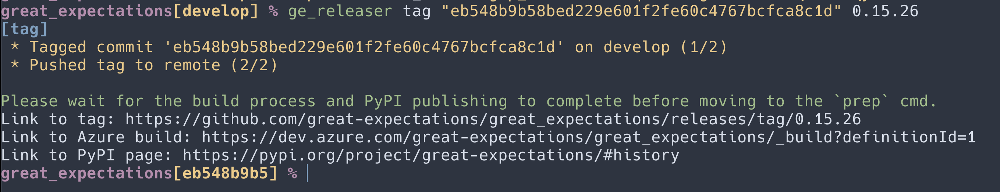
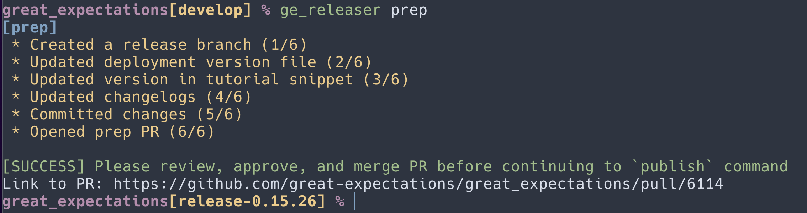
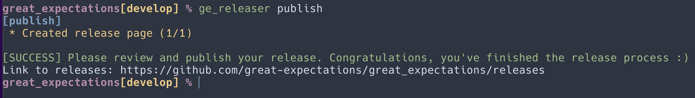

[](https://results.pre-commit.ci/latest/github/greatexpectationslabs/ge_releaser/main)

# ge_releaser

A CLI tool built to streamline the process of cutting releases each week in the OSS repository.

---

## Version release policy

In general:

- A new OSS version is released at least once a week (typically on Wednesdays)
- We use semantic versioning: typically, the new version will get a patch bump, unless a major or minor version bump is [required](#bumping-minor-version).
- Releases are announced in the public Great Expectations Slack workspace in the `#gx-releases` channel

Note: In any given week, we may skip the release (eg. during holidays) or do additional ad hoc releases (eg. when we need to immediately release a feature for GX Cloud).

### Bumping minor version

To determine whether a minor version bump is required, check the commits that have been made to the `great_expectations` repository since the last OSS release. Commits can be checked by looking at the [pull requests](https://github.com/great-expectations/great_expectations/pulls?q=is%3Apr+) tab in GitHub, or by running `git log --oneline` after pulling the `develop` branch locally. If any commits in the upcoming release contain a PR with the title tag `[MINORBUMP]`, the release should have a minor version bump instead of a patch version bump.

*We try to follow semantic versioning when choosing to bump the minor version. In particular, new functionality being made public constitutes a minor version bump. New functionality is considered public when the `@public_api` decorator is added. If possible, this decorator should not be added until the end of an epic to ensure that we are shipping complete features. NOTE: There will likely be a doc change accompanying feature releases- it is advisable to wait until the docs PR is also ready to merge before adding the `@public_api` decorator.*

---

## Installation

To install the `ge_releaser` CLI tool, run the following commands:

```bash
git clone git@github.com:greatexpectationslabs/ge_releaser.git
cd ge_releaser
python -m venv .venv
. .venv/bin/activate
pip install -e .
```

### Overview

The `ge_releaser` acts as an abstraction on top of our standard manual release process. When releasing, carefully follow the detailed instructions [below](#how-to-release).

At a high level, the following commands are used to release the latest version of the GX Core OSS version:

```bash
# Commands are meant to be run sequentially
ge_releaser tag <git_hash> <semver>      # Tag the appropriate commit and trigger the build/deploy to pypi process
ge_releaser prep                         # Modify changelog and open a PR.
ge_releaser publish                      # Create a new GitHub release page
```

These commands are executed in the `great_expectations` directory from within the `ge_releaser` virtual environment. Unless resolving merge conflicts, **do NOT run isolated `git` commands**- this tool is designed to do (pretty much) everything for you.

---
## How to release

While the following steps should get you creating releases with ease, it is also important to understand what is happening under the hood. For each of the primary commands that the `ge_releaser` offers, the individual manual steps taken by the machine are detailed below in the [Appendix](#manual-steps-behind-ge_releaser-commands). Although you shouldn't have to use them, they will be handy if debugging is required.

> :warning: For major or minor version releases, docs will need to be versioned manually. Please see the versioning instructions [here](https://github.com/great-expectations/great_expectations/tree/develop/docs/docusaurus#versioning) for how to version docs.


### Prerequisites

Before proceeding with the `ge_releaser` commands:

1. Install and setup the `ge_releaser` tool using the instructions [above](#installation).

1. Create and copy a new [personal access GitHub token](https://docs.github.com/en/authentication/keeping-your-account-and-data-secure/creating-a-personal-access-token) for the release
   - Create a `classic` token. `Fine-grained tokens` are not currently supported.
   - Give the token `repo` permissions.
   - Authorize the token for use with [SAML SSO](https://docs.github.com/en/enterprise-cloud@latest/authentication/authenticating-with-saml-single-sign-on/authorizing-a-personal-access-token-for-use-with-saml-single-sign-on). Be sure to copy the token before you take this step- you won't be able to see the token afterwords.

### tag

NOTE: Before running this command, ask the team about any unmerged PR's that might need to go in before the release.

1. Activate the `ge_releaser` virtual environment if it isn't already activated by running `. .venv/bin/activate` from within the `ge_releaser` directory.

1. Navigate to the `great_expectations` repository. Verify that you're on the `develop` branch.

1. Define the following environment variables:

      ```
     export GITHUB_TOKEN=<token>
      ```
   (Optional) If the release isn't from the `develop` branch, select the release trunk:

    ```
    export GE_RELEASE_TRUNK=0.18.x
    ```
    More information on overriding the default trunk value can be found [here](#overriding-the-default-trunk-value).

1. Run the `tag` command:

    ```
    ge_releaser tag --stable "<commit_hash>" "<release_version>"

    # Examples:
    ge_releaser tag --stable HEAD 0.18.8
    ge_releaser tag --stable eb548b9b58bed229e601f2fe60c4767bcfca8c1d 0.18.8
    ```
    The command output should resemble:
    

    The following error occurs if you do not have sufficient permissions to push a tag to the repository. You must be added to the open source core group which gives you maintainer permissions.

    ```
    git.exc.GitCommandError: Cmd('git') failed due to: exit code(1)
      cmdline: git push origin 0.18.8
      stderr: 'remote: error: GH013: Repository rule violations found for refs/tags/0.18.8.
    remote: Review all repository rules at https://github.com/great-expectations/great_expectations/rules?ref=refs%2Ftags%2F0.18.8
    remote:
    remote: - Cannot create ref due to create name restrictions.
    remote:
    To github.com:great-expectations/great_expectations.git
     ! [remote rejected]     0.18.8 -> 0.18.8 (push declined due to repository rule violations)
    error: failed to push some refs to 'github.com:great-expectations/great_expectations.git''
    ```

1. **IMPORTANT**: Wait until the [PyPi Deployment](https://github.com/great-expectations/great_expectations/deployments/pypi) finishes and the new release version is published to the [PyPi page](https://pypi.org/project/great-expectations/#history) before proceeding with the `prep` command. Now is a good time to start a thread in `#gx-platform-release` about the release. Post updates to this thread as the release progresses.

### prep

1. Verify that no untracked files or sensitive information (eg. credentials) will be committed and pushed to the repository.

1. Run the `prep` command to generate the changelog, update relevant files, and draft a PR titled `[RELEASE] <RELEASE_NUMBER>`:

    ```
    ge_releaser prep
    ```
    The command output should resemble:
    

1. Review the contents of this PR and ensure it looks appropriate before merging.
   - Verify that the new changelog entry only contains changes that have transpired between the last release and this current one.
   - Ensure that any external contributors recieve attribution for their efforts.
   - NOTE: If a release commit before `HEAD` was selected the changelog may include additional entries- these should be removed - they will be automatically included in the next relase changelog
   - If any PRs were merged after the release tag, remove their entries from the changelog as they won't make it into this release and would otherwise be duplicated in the next release's changelog.

### publish

1. Merge the release PR after it has been approved.

1. Run the `publish` command to take the changelog notes generated from the `prep` step and write them to our GitHub Releases page:

    ```
    ge_releaser publish
    ```
   The command output should resemble:

    


### Community announcement

The final step in the release process is crafting a message for our public Slack community. The release message should have the following format:

> :gx-blinking-logo-slow: :mega: :gx-blinking-logo-slow: We are pleased to announce the release of Great Expectations 1.<MINOR>.<PATCH>! We’d like to give a special thanks to our contributors:
>
> - \<contributor name\> for contributing \<contribution description\>
> - \<contributor name\> for contributing \<contribution description\>
> - …
>
> Some of the highlights:
>
> - \<release highlight\>
> - \<release highlight\>
> - …
>
> The complete changelog is [here](link to release notes).

where `<contributor name>` is either a persons Slack (preferred) or GitHub handle.

Highlights do not all need to be user facing- things like added test coverage and reworked internals to support upcoming features are great things to highlight.

For examples, look in [#gx-platform-release](https://greatexpectationstalk.slack.com/archives/C050KHMU3M3).

## Appendix

### Manual steps behind `ge_releaser` commands

#### tag:

1. Checkout the specific commit you want to tag: `get checkout <commit_hash>`
1. Create a tag for the new release: `git tag -a <release_version> -m "<release_version>"; git push origin <release_version>`
1. Wait for Azure to finish its checks. A successful run will automatically publish the new version to PyPI.

#### prep:

1. Pull remote changes into your local `develop`: `git checkout develop; git pull origin/develop`
1. Create a new branch from `develop` called `release-X.Y.Z`: `git checkout -b release-X.Y.Z`
1. Update the version in `great_expectations/deployment_version`.
1. Update the version in `docs/tutorials/getting_started/tutorial_version_snippet.mdx`.
1. Add a new entry to `docs/changelog.md` according to the [formatting guidelines](#formatting-the-community-announcement-changelog).
   - Ensure that lines are ordered by: `[BREAKING] | [MINORBUMP] | [FEATURE] | [BUGFIX] | [DOCS] | [MAINTENANCE]`
   - Ensure that each line has a reference to its corresponding PR.
   - If coming from an external contributor, make sure the line ends in `(thanks @<contributor_id>)`.
   - Make sure we're only adding commits that have transpired between the last release and this current one.
1. Commit these four files and create a PR against `develop`: `git add great_expectations; git commit -m "release prep"; git push`
1. Receive approval and merge the PR.

    #### Formatting the Community Announcement Changelog

    Entries in the changelog should appear as:

    > [FEATURE] Enable customization of candidate Regular Expression patterns when running OnboardingDataAssistant ([#7104](https://github.com/great-expectations/great_expectations/pull/7104))

    Specifically:

    - Capitalize the first letter of the subject after the [TAG]
    - Do not use punctuation as the first character of the subject after the [TAG]
    - Tags are one of the defined tags in our [contributor guide](https://docs.greatexpectations.io/docs/contributing/contributing_checklist/#1-create-a-pr)
    - Make clear call-outs for adding expectations by including the name of the expectation (ex: expect_values_are_prime_numbers)
    - PRs should be written in the present tense
    - The PR numbers should appear in parenthesis and be linked to the PR
    - Contributors are credited with (thanks @username)

#### publish:

Create a release entry in GitHub.

#### post-release:

1. Send a draft message (to be reviewed by the team) to `#gx-platform-release`, with the message that will be sent in the community Slack.
1. Send the reviewed message to the community Slack channel `#gx-releases`.
1. Request emoji signal boosting from the team in the private Slack channel `#gx-platform-release`.

### Overriding the default trunk value

If you're doing a pre-v1 bugfix you may need to change the trunk value to something other than `develop`.
`ge_releaser` will check for an environment variable called `GE_RELEASE_TRUNK` and use this if it is set instead of `develop`.

Example: `export GE_RELEASE_TRUNK=0.18.x`

### Yanking Releases

Although it shouldn't be a common occurrence due to our CI, there may be situations that necessitate the removal or yanking of a release.

In the case a release needs to be yanked, please take the following steps:

1. Patch the issue and release a new version (following all the steps noted above).

1. Pair with a PyPI maintainer with "Owner" privileges (as of 1.3.11 Bill and Don are owners).
   - Navigate to `Your account` -> `great_expectations` -> `Releases`.
   - Click the `Options` drop-down for the target release and select `Yank`.
   - Omit the `Reason` field and submit.

1. Draft a community announcement, have the team review it in `#gx-platform-release`, and send the reviewed message to the community Slack `#gx-releases` channel.

### Troubleshooting

To enable more verbose logging, you can set the `GE_RELEASER_LOG_LEVEL` environment variable.
